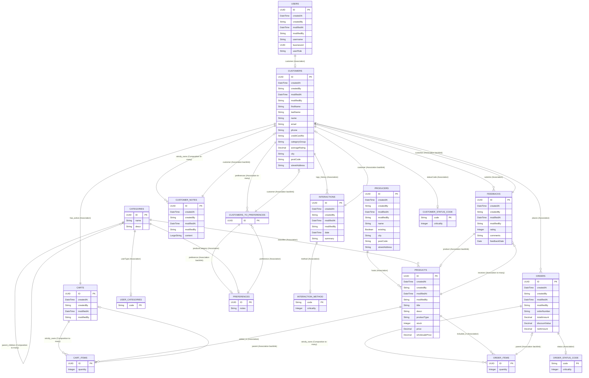

### Cat-Connect Customer Management Module and Sales Order Service

A robust Full-Stack corporate ecosystem built on the **SAP Cloud Application Model (CAP v9)** and **SAPUI5 Freestyle / Fiori Elements**, deployed directly inside the **SAP BTP** cloud infrastructure utilizing **SAP HANA Cloud** database integration.

The architecture represents an enterprise-grade ecosystem comprising two core business context blocks: an interactive customer-facing game catalog web-shop (**Sales Order Subsystem**) and a privileged operational dashboard (**Gamer CRM Subsystem**). To eliminate data fragmentation across these domains, the platform integrates a centralized **Master Data Management (MDM)** framework orchestrating core master records—such as Products Catalog metadata—ensuring a single source of truth. The application is engineered in strict compliance with enterprise security frameworks, native runtime execution states (Lean Drafts), dynamic MDM context cross-sync via SAP Service Mesh, and automated deep transaction validations.


**Deployed Production Endpoint:** [cat-connect-live-btp](https://7ac3bc9btrial-dev-cat-connect.cfapps.us10-001.hana.ondemand.com/)


---

## 🗺️ Domain Architecture & Core Data Model

The backbone of the **Сat-connect** platform is designed as a canonical domain data model explicitly segregated into distinct, isolated functional contexts. Relational mappings and semantic links between system entities are natively orchestrated utilizing core SAP Cloud Application Model (CAP) paradigms: **Associations**, **Compositions**, and **Aspects**. 

This foundational entity alignment guarantees optimal enterprise data consistency, prevents cross-context boundary violations, and provides a unified interface metadata layout for both frontline Fiori Elements applications and freestyle web-shop interfaces.


### Database Schema Relations (Core Entities)

| Source Entity                  | Target Entity                 | Relation Type             | Brief Description                   |
| :----------------------------- | :---------------------------- | :------------------------ | :---------------------------------- |
| **Users**  | crm.Customers                 | Association               | Technical user linked to Customer   |
| **salesorder.Products**        | salesorder.Producers          | Association               | Linked to a specific Producer       |
| **salesorder.Products**        | salesorder.Categories         | Association               | Linked to a game genre Category     |
| **salesorder.Products**        | crm.Feedbacks                 | Association (to-many)     | Has many Feedbacks row links        |
| **salesorder.Producers**       | salesorder.Products           | Association (to-many)     | Producer hosts multiple Products    |
| **salesorder.Categories**      | salesorder.Categories         | Association               | References a parent Category        |
| **salesorder.Categories**      | salesorder.Categories (child) | **Composition (to-many)** | Strictly owns child subcategories   |
| **salesorder.Categories**      | salesorder.UserCategories     | Association               | Linked to a user gaming segment     |
| **salesorder.Orders**          | crm.Customers                 | Association               | Order belongs to a Customer         |
| **salesorder.Orders**          | salesorder.OrderStatusCode    | Association               | Linked to an order status code      |
| **salesorder.Orders**          | salesorder.OrderItems         | **Composition (to-many)** | Strictly owns Order line items      |
| **salesorder.OrderItems**      | salesorder.Orders             | Association               | Backlink to parent Order row        |
| **salesorder.OrderItems**      | salesorder.Products           | Association               | Item links to specific Product      |
| **salesorder.Carts**           | crm.Customers                 | Association               | Cart belongs to a Customer          |
| **salesorder.Carts**           | salesorder.CartItems          | **Composition (to-many)** | Strictly owns Cart line items       |
| **salesorder.CartItems**       | salesorder.Carts              | Association               | Backlink to parent Cart row         |
| **salesorder.CartItems**       | salesorder.Products           | Association               | Line item links to specific Product |
| **crm.Customers**              | salesorder.Orders             | Association (to-many)     | Customer places multiple Orders     |
| **crm.Customers**              | salesorder.Carts              | Association               | Links Customer to their active Cart |
| **crm.Customers**              | crm.CustomerStatusCode        | Association               | Linked to a customer status code    |
| **crm.Customers**              | crm.Interactions              | Association (to-many)     | History log of multiple Activities  |
| **crm.Customers**              | crm.Feedbacks                 | Association (to-many)     | Customer submits multiple Feedbacks |
| **crm.Customers**              | crm.CustomerNotes             | **Composition (to-many)** | Strictly owns internal Notes        |
| **crm.Customers**              | crm.CustomersToPreferences    | Association (to-many)     | Links to preference junction table  |
| **crm.Preferences**            | salesorder.Categories         | Association               | Linked to a game genre Category     |
| **crm.CustomersToPreferences** | crm.Customers                 | Association               | Backlink to the Customer row        |
| **crm.CustomersToPreferences** | crm.Preferences               | Association               | Link to specific Preference data    |
| **crm.Feedbacks**              | crm.Customers                 | Association               | Feedback belongs to a Customer      |
| **crm.Feedbacks**              | salesorder.Products           | Association               | Feedback belongs to a Product       |
| **crm.Interactions**           | crm.Customers                 | Association               | Backlink to target Customer row     |
| **crm.Interactions**           | crm.InteractionMethod         | Association               | Linked to a communication method    |
| **crm.CustomerNotes**          | crm.Customers                 | Association               | Backlink to owner Customer row      |
| **Address aspect**             | _Customers / Producers_       | **Aspect (In-line)**      | Reusable fields extending entities  |


---

---

## Role-Based Access Control (RBAC)

Access to the cat-connect ecosystem infrastructure is globally secured and restricted by an explicit authentication requirement. Within the runtime layer, functional permissions and data mutations are distributed declaratively via `@restrict` annotations to enforce strict business compliance rules across all service contexts:

* **CRMAdmin**: Possesses absolute root control over all system entities across both contexts. This is the only privileged role authorized to physically execute destructive operations (`DELETE`) on customer master rows and core entity datasets.

<details>
<summary>CRM Subsystem Roles</summary>

* **SalesManager**: Possesses full functional `READ`, `CREATE`, and `UPDATE` capabilities for client profiles and operational interactions logs. Prohibited from destructive actions (`DELETE`). Authorized to invoke transaction-safe custom bound actions and process user interaction pipelines.
* **SupportAgent**: Bound to a strict, non-mutating `Read-Only` operational mode across customer datasets, feedbacks matrices, and system master codes list. Any unauthorized draft processing or data mutation is implicitly rejected by the CAP backend.

</details>

<details>
<summary>Sales Order Subsystem Roles</summary>

* **SalesManager**: Authorized to oversee customer order parameters and review analytical bulk metrics (`READ`, `CREATE`, `UPDATE` on Orders). Retains cross-context query access to monitor shopping carts (`READ` on Carts) and invoke wholesale parameters checks (`checkBulkEligibility`). Natively restricted from catalog modification pipelines.
* **Customer**: Scoped authenticated player profile. Natively bound by strict row-level security (RLS) data isolation policies to guarantee personal workspace privacy:
  * Manages personal shopping carts via full lifecycle access (`*` on Carts where `customer_id = $user.id`).
  * Processes self-service order placements and history sheets (`READ`, `CREATE`, `UPDATE` on Orders where `customer_id = $user.id`).
  * Executes wholesale eligibility context validations (`checkBulkEligibility`).
  * Modifies select personal contact details inside their active session container (`READ`, `UPDATE` on ClientProfile where `ID = $user.id`).
* **Supplier**: Privileged supply-chain context. Globally limited to cross-reference product metrics and active catalog items logs (`READ` on Orders and Products). Prohibited from entering transactional loops or modifying data states.
* **authenticated-user**: The baseline system security shell context. Natively authorized to browse the general games catalog grid, evaluate genres, and view prices (`READ` on Products). Restricted from accessing any transactional data rows or profile assets until a specific role context is established.

</details>

<details>
<summary>MDM Subsystem Roles</summary>

* Now is managed only by CRMAdmin, but this list can be expanded

</details>


---

### Implemented Business Logic & UX Enhancements

<details>
<summary>CRM Subsystem Business Logic</summary>

### 1\. Custom Bound Action: Clear All Notes

A transaction-safe custom action (`clearNotes`) is established for bulk removal of history logs. When triggered, the backend concurrently wipes records from both active and draft tables, instantly returning the refreshed host model.

### 2\. Deep Transactional Validation

A custom JavaScript before-handler guards data mutation before saving drafts. It screens out empty placeholders or ghost space characters in customer names and terminates processing if any cascade draft note is under 5 characters.

### 3\. Average Rating Calculation

A backend trigger fires whenever a gamer logs an evaluation. The system automatically recalculates the global `averageRating` within the specific Customer master row upon every feedback creation.

### 4\. "At Risk" Status Auto-Update

An automated loyalty monitor scans customer health indicators. If a client's metrics slip below predefined thresholds, the system reassigns their `statusCode` to `at_risk` for immediate account management follow-up.

### 5\. Dynamic Cross-Service Mesh Interaction & Timeline Logging
A zero-duplication event driven architectural pattern. When an operational manager triggers the `cancelOrder` action on the Sales side, the system bypasses strict transactional database silos and routes an instant internal service mesh push to the isolated CRM module. The CRM context logs the data inside the runtime active timeline context without local physical source rows duplication.


### 6\. Customer Category Calculation

A classification algorithm analyzes customer purchase histories and registered genres. The backend dynamically sets the customer's gamer profile (`categoryGroup`) to groups such as `CYBERSPORT` or `RETRO`.

### 7\. Quick Insights (Top-5 Limitation)

The interface is tailored to present exactly the last 5 activities on a user profile sheet. Leveraging OData v4 presentation metadata annotations (`UI.PresentationVariant`), the system automatically orders rows by timeline data and caps records to 5 items, mitigating database overhead.

### 8\. Live Real-Time Activity Streaming
To comply with data isolation matrices, the Interaction History table is designed as a hybrid virtual view. Upon every metadata read request (`READ Interactions`), the backend dynamically queries the detached Sales Order subsystem database, maps active purchase headers on-the-fly, synchronizes the strict `@odata.count` layout parameters, and streams a unified customer activity timeline back to the Fiori Elements SmartTable UI.


</details>

<details>
<summary>Sales Order Subsystem Business Logic</summary>

### 1. Transactional Warehouse Stock Lock
A strict database-level concurrency control mechanism guards the product catalog against stock depletion. During the checkout pipeline execution, the backend intercepts the transactional unit and verifies line item amounts against live database values. If the requested purchase quantity exceeds the physical warehouse balance (`quantity > stock`), the operation is instantly aborted, preventing a negative stock state.

### 2. Automated Stock Rollback Engine
To preserve data consistency across decoupled processes, a transactional database trigger is mapped to the custom bound OData action `cancelOrder`. Upon successful invocation of a validated cancellation request, the system automatically aggregates the line items from the target order and restores the reserved product copies back to the live inventory database balance in a single transactional block.

### 3. Review Validation Contract (Validation Lock)
To enforce strict data compliance and prevent spam submissions, a backend validation routine locks the creation of feedback records under the business rule: *one successful order allows exactly one feedback submission*. The feedback action button and underlying OData insertion handlers are dynamically unlocked strictly for transactions retaining a completed lifecycle state (`Status = 'Completed'`).

### 4. Cross-Context Marketing Feedbacks & Dynamic CRM Rating Discount
Customer feedback submissions generated within the Sales Order subsystem are structurally formatted to serve downstream marketing and promotional pipelines. Upon submission, a background database trigger pushes the rating metrics into the Gamer CRM subsystem to calculate the customer’s unified analytical profile. When the user initiates a checkout loop, the `CartManager.ts` pipeline triggers a specialized OData pre-fetch call (`getCartEligibilities`). The backend reads the calculated `averageRating` directly from the CRM Customer master data record and dynamically transforms this rating metric into a live financial discount percentage inside the shopping cart.

### 5. Advanced Frontend Grid Filtering and Presentation Layer
To optimize user data navigation across dense tables, the frontend grid controllers deploy custom filtering pipelines for both product catalogs and historical order registers. The multi-vector filtering layer allows players to execute multi-criteria queries (sorting by genre codes, price ranges, and real-time execution statuses) directly within the UI5 runtime, optimizing UI responsiveness and minimizing redundant OData roundtrips to SAP HANA Cloud.

### 6. Scoped Custom Navigation Architecture
The user interface implements a strict custom routing pattern decoupled from generic Fiori templates. Transition states between the primary storefront catalog, active shopping carts, and completed order summaries are orchestrated using custom route matching and dedicated navigation controllers (`onNavBack`, target mapping configuration). This architecture preserves frontend state persistence, passes necessary entity context IDs safely between views, and blocks access to uninitialized transactional pages.


### 7. Active Session Cache and State Retention Pipeline
To minimize database query overhead during frequent interface refreshes, the storefront deploys a specialized runtime state initialization mechanism orchestrated via `LoginManager.ts`. Upon application bootstrap inside the SAP BTP infrastructure, the controller intercepts active browser cookies and securely maps the session parameters to local storage storage vectors. This frontend pipeline acts as a high-performance local proxy layer, keeping context data persistent across page reloads and entirely removing the necessity for redundant OData metadata re-fetches.

</details>

<details>
<summary>MDM Subsystem Business Logic</summary>

### 1. Cross-Context Identity & Access Orchestration (Shared IAM Layer)
The system deploys a centralized `Users` register operating as an MDM Identity Mapping matrix. Instead of duplicate tenant entries, tech authorization records natively map system logons to clean `crm.Customers` master data UUIDs, ensuring consistent cross-subsystem workspace routing.

### 2. Zero-Duplication MDM Master Records Propagation
To mitigate multi-system replication lag and database storage bloat, product catalogs and active customer indicators are decoupled from transactional domains. Subsystems interact dynamically via SAP Service Mesh event distribution channels without creating unmanaged source table mirrors.

### 3. Federated Schema Field-Level Governance
The global master record lifecycle relies on strict declarative `@mandatory` parameters, formatting validation hooks, and relational integrity guards. Any structural changes or modifications inside local subsystem draft sessions are automatically verified against the root enterprise domain definition before final database consolidation.


</details>

---

## 🛠️ Local Development & Script Registers

The root operational configuration coordinates environment watch pipelines, multi-context test execution suites, and compilation workflows. Execute the following preset script vectors from the root `package.json` to manage localized and production runtimes:

### 1. Unified Backend Architecture
* **Launch Local Development Server (In-Memory Database)**
  ```bash
  npm run start-dev
  ```
  *Under the hood:* Runs `cds watch --in-memory` to orchestrate continuous hot-reloading of `.cds` metadata schemas, mock security mocks mapping, and automated TypeScript compilation.

### 2. Isolated UI5 Frontend Applications Runtime
* **Execute Frontline Sales Order Subsystem UI Client**
  ```bash
  npm run start-so
  ```
  *Under the hood:* Instantiates `ui5 serve --config ui5.yaml --port 8090` to compile, transpile via `ui5-tooling-transpile`, and expose the interactive web-shop on local port 8090.
* **Execute Management Gamer CRM Fiori Interface**
  ```bash
  npm run watch-crm_customers
  ```
  *Under the hood:* Invokes localized application proxy flags to render the Fiori Elements application sheet with active cache mitigation parameters.

### 3. Automated Validation & Test Orchestration Pipeline
* **Execute Full Comprehensive Suite (All Contexts)**
  ```bash
  npm test
  ```
  *Under the hood:* Concurrently triggers all isolated execution pipelines to perform holistic quality gate evaluations.
* **Execute Gamer CRM Backend Integration Specs**
  ```bash
  npm run test:crm
  ```
* **Execute Sales Order Core Integration Specs**
  ```bash
  npm run test:sales
  ```
* **Execute Shopping Cart Frontend State Specs**
  ```bash
  npm run test:cart
  ```

### 4. Production Build & Bundling
* **Compile Cloud-Ready MTA Deployment Artifacts**
  ```bash
  npm run build
  ```
  *Under the hood:* Executes parallel minification workflows (`ui5 build`) to optimize frontend resources and packages the backend metadata configurations for SAP BTP Cloud Foundry distribution.


---

---

## 🧪 Comprehensive Integration & State Testing

The cat-connect ecosystem features a decoupled, fully automated verification layer operating over a synchronized in-memory SQLite database instance. This testing framework isolates operational runtime boundaries and validates data layer behavior before deployment artifacts compilation.

A robust suite of automated execution scripts spans multiple specialized test vectors across three independent files, covering the entire cross-context application pipeline:

* **Core Business Logic Validation**: Tests enforce deep transaction controls, automated database triggers, mathematical calculations inside the custom pricing pipeline, and multi-vector analytical metric recalculations.
* **Role-Based Access Control (RBAC)**: Validates granular security annotations, row-level data isolation policies, and privileged execution constraints across all enterprise profiles (`CRMAdmin`, `SalesManager`, `SupportAgent`, `Customer`).
* **Transactional State Integrity**: Verifies warehouse inventory boundaries, state transitions for complex data entities, draft orchestration pipelines, and deterministic stock recovery mechanics (`Stock Rollback`).

This comprehensive automated coverage serves as a strict technical quality gate, mitigating code regression risks and ensuring 100% execution stability across both localized environments and live cloud production deployments.

---

### Continuous Integration & Deployment (CI/CD)

The project leverages a robust GitHub Actions deployment pipeline (representing our successful 22nd launch):

- Every push to the deployment branch boots up a clean virtual runner runner instance.
- The test harness executes all 9 integration tests in a clean room environment.
- Upon successful verification, the code compiles into a deployment-ready `.mtar` package.
- The Cloud Foundry CLI establishes a pipeline hook to push the droplet directly to the SAP BTP space.
- The automated system handles live data migrations inside SAP HANA Cloud and restarts the primary Node.js application process.

### 📊 Database ER-Diagram (Core Schema & Context Relations)



