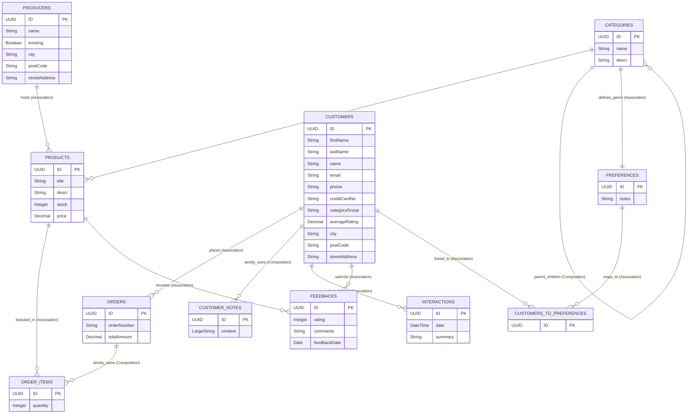

### Cat-Connect CRM — Customer Management Module (Part 1)

A business-oriented CRM system built on SAP Cloud Application Model (CAP) v9, deployed in the SAP BTP cloud infrastructure utilizing SAP HANA Cloud and presented via a crisp SAP Fiori Elements frontend.

The project is designed in strict compliance with corporate security frameworks, native draft support (Lean Drafts), and robust automated business logic validation.

🔗 **Deployed Application URL:** 7ac3bc9btrial-dev-cat-connect.cfapps.us10-001.hana.ondemand.com

---

### Architecture & Data Model

The core of the CRM module is a canonical domain data model split into distinct functional contexts. Relationships between entities are established using native CAP mechanisms: Associations, Compositions, and Aspects.

### Database Schema Relations (Core Entities)

| Source Entity                  | Target Entity                 | Relation Type             | Brief Description                   |
| :----------------------------- | :---------------------------- | :------------------------ | :---------------------------------- |
| **salesorder.Products**        | salesorder.Producers          | Association               | Linked to a specific Producer       |
| **salesorder.Products**        | salesorder.Categories         | Association               | Linked to a game genre Category     |
| **salesorder.Products**        | crm.Feedbacks                 | Association (to-many)     | Has many Feedbacks row links        |
| **salesorder.Producers**       | salesorder.Products           | Association (to-many)     | Producer hosts multiple Products    |
| **salesorder.Categories**      | salesorder.Categories         | Association               | References a parent Category        |
| **salesorder.Categories**      | salesorder.Categories (child) | **Composition (to-many)** | Strictly owns child subcategories   |
| **salesorder.Orders**          | crm.Customers                 | Association               | Order belongs to a Customer         |
| **salesorder.Orders**          | salesorder.OrderItems         | **Composition (to-many)** | Strictly owns Order line items      |
| **salesorder.OrderItems**      | salesorder.Orders             | Association               | Backlink to parent Order row        |
| **salesorder.OrderItems**      | salesorder.Products           | Association               | Item links to specific Product      |
| **crm.Customers**              | salesorder.Orders             | Association (to-many)     | Customer places multiple Orders     |
| **crm.Customers**              | crm.Interactions              | Association (to-many)     | History log of multiple Activities  |
| **crm.Customers**              | crm.Feedbacks                 | Association (to-many)     | Customer submits multiple Feedbacks |
| **crm.Customers**              | crm.CustomerNotes             | **Composition (to-many)** | Strictly owns internal Notes        |
| **crm.Customers**              | crm.CustomersToPreferences    | Association (to-many)     | Links to preference junction table  |
| **crm.Preferences**            | salesorder.Categories         | Association               | Linked to a game genre Category     |
| **crm.CustomersToPreferences** | crm.Customers                 | Association               | Backlink to the Customer row        |
| **crm.CustomersToPreferences** | crm.Preferences               | Association               | Link to specific Preference data    |
| **crm.Feedbacks**              | crm.Customers                 | Association               | Feedback belongs to a Customer      |
| **crm.Feedbacks**              | salesorder.Products           | Association               | Feedback belongs to a Product       |
| **crm.CustomerNotes**          | crm.Customers                 | Association               | Backlink to owner Customer row      |
| **Address aspect**             | _Customers / Producers_       | **Aspect (In-line)**      | Reusable fields extending entities  |

---

### Role-Based Access Control (RBAC)

Access to the service is globally restricted by an explicit authentication requirement. Within the service, permissions are distributed declaratively via `@restrict` annotations to meet strict business compliance rules:

- **CRMAdmin**: Absolute control over all CRM entities. The only role authorized to physically drop (`DELETE`) customer root data.
- **SalesManager**: Possesses full `READ`, `CREATE`, and `UPDATE` capabilities for customers and interactions. Prohibited from destructive actions (`DELETE`). Authorized to run custom bound actions.
- **SupportAgent**: Bound to a crystal-clear `Read-Only` mode across customers, feedbacks, and master codes. Any unauthorized draft processing or data mutation is rejected by the backend.

---

### Implemented Business Logic & UX Enhancements

### 1\. Custom Bound Action: Clear All Notes

A transaction-safe custom action (`clearNotes`) is established for bulk removal of history logs. When triggered, the backend concurrently wipes records from both active and draft tables, instantly returning the refreshed host model.

### 2\. Deep Transactional Validation

A custom JavaScript before-handler guards data mutation before saving drafts. It screens out empty placeholders or ghost space characters in customer names and terminates processing if any cascade draft note is under 5 characters.

### 3\. Average Rating Calculation

A backend trigger fires whenever a gamer logs an evaluation. The system automatically recalculates the global `averageRating` within the specific Customer master row upon every feedback creation.

### 4\. "At Risk" Status Auto-Update

An automated loyalty monitor scans customer health indicators. If a client's metrics slip below predefined thresholds, the system reassigns their `statusCode` to `at_risk` for immediate account management follow-up.

### 5\. Interaction Logging for Feedback Submissions

A background audit trail recorder is deployed. Submitting any user review automatically prompts the backend to generate and insert a new log row into the `Interactions` log, preserving date metrics and interaction vectors.

### 6\. Customer Category Calculation

A classification algorithm analyzes customer purchase histories and registered genres. The backend dynamically sets the customer's gamer profile (`categoryGroup`) to groups such as `CYBERSPORT` or `RETRO`.

### 7\. Quick Insights (Top-5 Limitation)

The interface is tailored to present exactly the last 5 activities on a user profile sheet. Leveraging OData v4 presentation metadata annotations (`UI.PresentationVariant`), the system automatically orders rows by timeline data and caps records to 5 items, mitigating database overhead.

---

### Local Development & Useful Scripts

For manual execution, entity watching, and project compilation, use the following preset script vectors from `package.json`:

- **Launch the local development runtime (In-Memory SQLite):**

  bash

      npm run start-dev

  _Under the hood:_ `cds watch --in-memory`

- **Execute all business logic & security integration tests (Jest):**

  bash

      npm run test:crm

  _Under the hood:_ `npx jest test/CrmService.test.js --verbose --runInBand`

- **Compile production-ready MTAR artifacts for cloud deployment:**

  bash

      npm run build

  _Under the hood:_ `cds build --production`

---

### Integration Testing (Jest & cds.test)

The project includes an isolated test layer operating over an in-memory SQLite database instance. A suite of 9 comprehensive automated scenarios validates the system behavior:

- Blocking unauthenticated requests with a strict `401 Unauthorized`.
- Accurate assessment of dynamic calculation blocks (`categoryGroup`) under Admin context.
- Hard backend rejection (`403 Forbidden`) when a Support Agent tries to invoke new entries.
- Security fence validation when a Sales Manager requests a records deletion.
- String sanitizer and cascade draft note length rules (intercepting expected `400 Bad Request` states).
- Proper processing of bound actions executed by authorized actors.
- Automatic rating adjustments and secondary interaction log recording upon review logging.
- Validating that Quick Insights pagination configurations are securely exposed in сompiled service metadata.

---

### Continuous Integration & Deployment (CI/CD)

The project leverages a robust GitHub Actions deployment pipeline (representing our successful 22nd launch):

- Every push to the deployment branch boots up a clean virtual runner runner instance.
- The test harness executes all 9 integration tests in a clean room environment.
- Upon successful verification, the code compiles into a deployment-ready `.mtar` package.
- The Cloud Foundry CLI establishes a pipeline hook to push the droplet directly to the SAP BTP space.
- The automated system handles live data migrations inside SAP HANA Cloud and restarts the primary Node.js application process.

### 📊 Database ER-Diagram (Core Schema & Context Relations)

